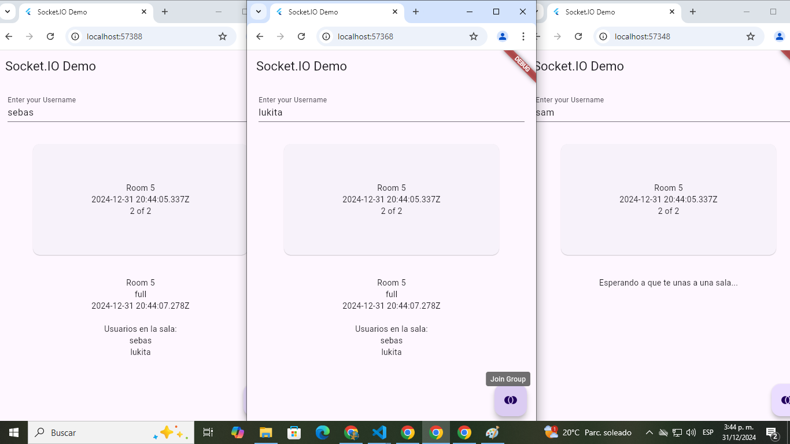

# 🚀 Sistema de Salas con Flutter y Nodejs (Socket.IO)

[](https://flutter.dev)

[](LICENSE)



## 📚 Descripción

Este proyecto es una aplicación de ejemplo para aprender a trabajar con **Socket.IO** en un backend **Node.js** y una app cliente móvil en **Flutter**. El proyecto permite la creación y gestión de salas de usuarios en tiempo real, donde los usuarios se unen a una sala, pueden ver la información en tiempo real y participar en la misma.

## 🎯 Objetivo del Proyecto

- Aprender a integrar **Socket.IO** con un backend en **Node.js**.
- Crear una aplicación móvil en **Flutter** que se conecte a un servidor **Socket.IO**.
- Practicar la gestión de estados en tiempo real con **WebSockets**.
- Implementar un sistema de creación de salas, gestión de usuarios y control de tiempos en un servidor **Node.js**.

## 🛠️ Características

- **Socket.IO**: Comunicación en tiempo real entre el backend (Node.js) y la app móvil (Flutter).
- **Gestión de Salas**: Los usuarios pueden unirse a una sala y visualizar información de la sala.
- **Contador de Tiempo**: Cada sala tiene un tiempo de expiración configurable.
- **Conexión WebSocket**: Utilización de `socket_io_client` en Flutter para conectar con el servidor Node.js.
- **Persistencia de Datos**: Almacenamiento de salas de usuarios en el servidor para su posterior recuperación.

## 📂 Estructura del Proyecto

### Servidor Node.js

```plaintext
src/
    ├── models/             # Modelos de datos como RoomModel y UserModel
    ├── utils/              # Utilidades como TimeCountdown
├── server.js           # Punto de entrada para el servidor Socket.IO
└── package.json        # Dependencias y scripts de Node.js
```

### Cliente Flutter

```plaintext
lib/
├── main.dart           # Punto de entrada de la app
├── models/             # Modelos de datos como RoomModel y UserModel
├── services/           # Servicios para la conexión WebSocket
```

## 🚀 Cómo Ejecutar el Proyecto

### Servidor Node.js 

1. Asegúrate de tener **Node.js** instalado. Si no lo tienes, sigue las instrucciones en la [documentación oficial](https://nodejs.org/en).

2. Clona este repositorio:

```bash
git clone https://github.com/BastianNaitsab/sistema_de_salas_websocket_flutter
```

3. Navega al directorio del servidor:

```bash
cd socketio_server_nodejs
```

4. Instala las dependencias:

```bash
npm install
```

5. Ejecuta el servidor:

```bash
node src/server.js
```

El servidor escuchará en el puerto `3000`.

### Cliente Flutter 

1. Asegúrate de tener Flutter instalado. Si no lo tienes, sigue las instrucciones en la [documentación oficial](https://flutter.dev/).

2. Clona este repositorio:

```bash
git clone https://github.com/BastianNaitsab/sistema_de_salas_websocket_flutter
```

3. Navega al directorio del cliente Flutter:

```bash
cd socketio_rooms_flutter
```

4. Instala las dependencias:

```bash
flutter pub get
```

5. Ejecuta el servidor:

```bash
flutter run
```

La app se ejecutará en un emulador o dispositivo físico y se conectará al servidor Socket.IO.

## 🧰 Herramientas Usadas

- **Node.js**: Backend en JavaScript.
- **Socket.IO**: Comunicación en tiempo real para WebSockets.
- **Flutter SDK**: Framework para desarrollo móvil.
- **Dart**: Lenguaje de programación de Flutter.
- **VS Code**: Editor de código.
- **Android Studio**: Emulador Android.

## 📖 Lo que He Aprendido

- 🌟 Cómo integrar Socket.IO en un servidor Node.js y conectarlo a un cliente Flutter usando WebSockets.
- 🌟 Cómo gestionar salas de usuarios en tiempo real.
- 🌟 Implementación de un sistema de contadores de tiempo en el servidor.
- 🌟 Comunicación entre el backend y el frontend en una app Flutter utilizando WebSockets.

## 📋 Próximos Pasos

- Mejorar la gestión de usuarios y salas, agregando persistencia en base de datos.
- Añadir autenticación de usuarios.
- Mejorar la UI/UX de la aplicación Flutter.
- Implementar pruebas unitarias y funcionales.

## 🤝 Contribuciones

Este proyecto es principalmente para aprendizaje personal, pero siéntete libre de proponer mejoras o sugerencias.

## 📞 Contacto
Bastian Naitsab - [devmentesacontacto@gmail.com](mailto:devmentesacontacto@gmail.com)  
GitHub: [BastianNaitsab](https://github.com/BastianNaitsab)